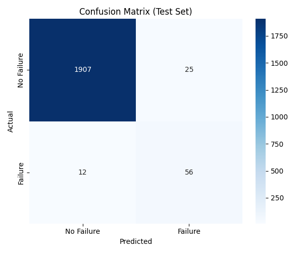
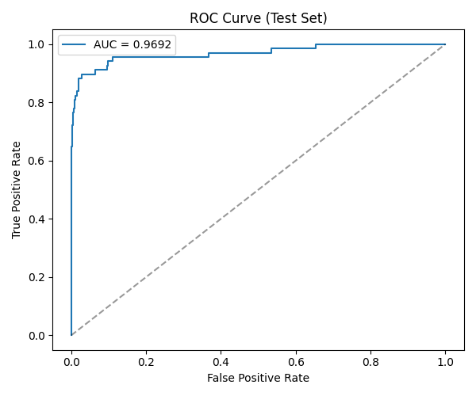
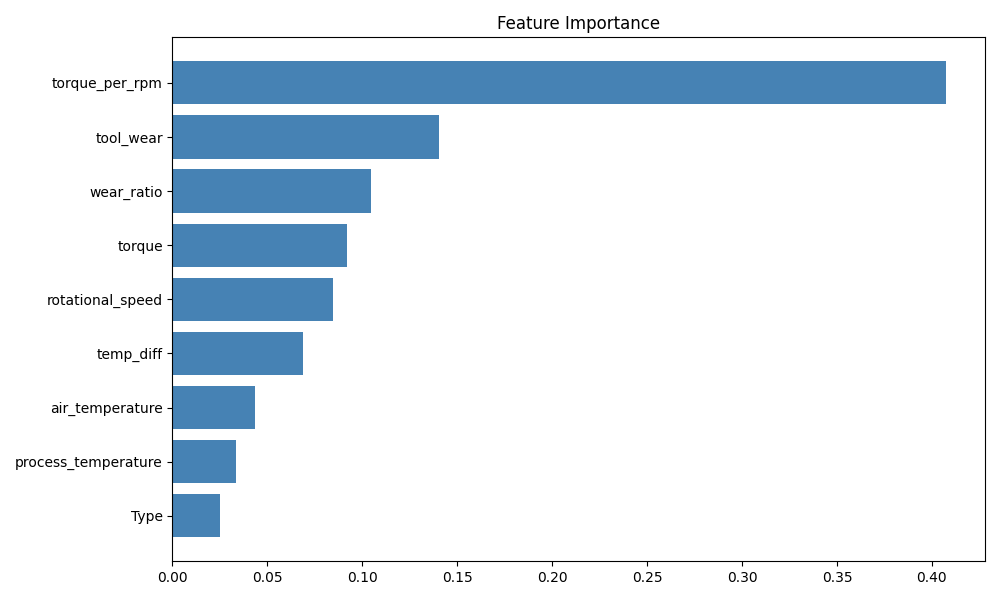

# FailureGuard — Machine Failure Prediction System

A full-stack predictive maintenance system that uses real-time sensor data to predict industrial machine failures before they happen.



---

## Overview

Industrial machines fail unexpectedly, causing unplanned downtime and costly repairs. This system takes six sensor readings from a machine and instantly predicts whether it is at risk of failure, using an XGBoost classifier trained on the AI4I 2020 Predictive Maintenance dataset.

The system consists of three parts — a trained ML model, a FastAPI backend that serves predictions, and a React frontend for interacting with it in real time.

---

## Project Structure

```
├── backend
│   └── app
│       ├── config.py
│       ├── features.py
│       ├── main.py
│       ├── model.py
│       └── schema.py
├── docs
│   └── ModelWorking.md
├── frontend
│   └── src
│       ├── App.jsx
│       ├── Header.jsx
│       ├── InputForm.jsx
│       ├── ResultPanel.jsx
│       ├── Gauge.jsx
│       ├── api.js
│       └── validation.js
├── LICENSE
├── ml
│   ├── dataset.csv
│   ├── model.pkl
│   ├── plots
│   ├── scaler.pkl 
│   ├── threshold.pkl
│   └── train.py
├── README.md
└── requirements.txt
```

---

## Model Performance

The model is trained on 7,000 samples and evaluated on a held-out test set of 2,000 samples it never saw during training or threshold tuning.

| Metric | Value |
|---|---|
| ROC-AUC | 0.969 |
| Recall — Failure class | 82% |
| Precision — Failure class | 69% |
| F1 — Failure class | 0.75 |
| Overall Accuracy | 98% |
| CV ROC-AUC (5-fold) | 0.971 ± 0.014 |

Out of 68 real failures in the test set, the model catches 56 before they happen. The decision threshold is set at 0.37 and tuned to prioritise recall, since missing a real failure is far more costly than a false alarm.




---

## Features Used

| Feature | Description | Unit |
|---|---|---|
| Type | Machine class — Low, Medium, High | Encoded 0 / 1 / 2 |
| Air Temperature | Ambient temperature | Kelvin |
| Process Temperature | Internal machine temperature | Kelvin |
| Rotational Speed | Spindle speed | RPM |
| Torque | Rotational force | Nm |
| Tool Wear | Accumulated tool usage time | Minutes |

Three additional features are engineered at runtime: temperature difference, torque per RPM, and wear ratio.

---

## Dataset

AI4I 2020 Predictive Maintenance Dataset by Stephan Matzka.
10,000 samples — 9,661 normal, 339 failures (3.4% failure rate).

[Download from Kaggle](https://www.kaggle.com/datasets/stephanmatzka/predictive-maintenance-dataset-ai4i-2020)

---

## Getting Started

### Prerequisites

- Python 3.12
- Node.js 18+

### 1. Clone the repository

```bash
git clone https://github.com/Atharv3221/FailureGuard.git
cd FailureGuard
```

### 2. Set up the backend

```bash
cd backend
python -m venv venv
source venv/bin/activat
pip install -r requirements.txt
```

### 3. Train the model (optional — artifacts already included)

```bash
cd ml
python train.py
```

This saves `model.pkl`, `scaler.pkl`, and `threshold.pkl` into the `ml/` directory.

### 4. Start the backend

```bash
cd backend
uvicorn app.main:app --reload
```

API runs at `http://127.0.0.1:8000`

### 5. Start the frontend

```bash
cd frontend
npm install
npm run dev
```

Frontend runs at `http://localhost:5173`

---

## API Reference

### Health Check

```
GET /
```

```json
{ "message": "API is running" }
```

### Predict

```
POST /predict
Content-Type: application/json
```

Request body:

```json
{
  "Type": 2,
  "air_temperature": 304.5,
  "process_temperature": 316.0,
  "rotational_speed": 1200,
  "torque": 75.0,
  "tool_wear": 240
}
```

Response:

```json
{
  "failure_prediction": 1,
  "failure_probability": 0.9996
}
```

`failure_prediction` is 0 for no failure and 1 for failure. `failure_probability` is a value between 0 and 1. Any probability above 0.37 is classified as failure.

---

## Tech Stack

| Layer | Technology |
|---|---|
| ML Model | XGBoost |
| Data & Scaling | pandas, scikit-learn |
| Artifact Storage | joblib |
| Backend | FastAPI, uvicorn |
| Validation | pydantic |
| Frontend | React 18, Vite |
| Styling | Plain CSS with CSS variables |

